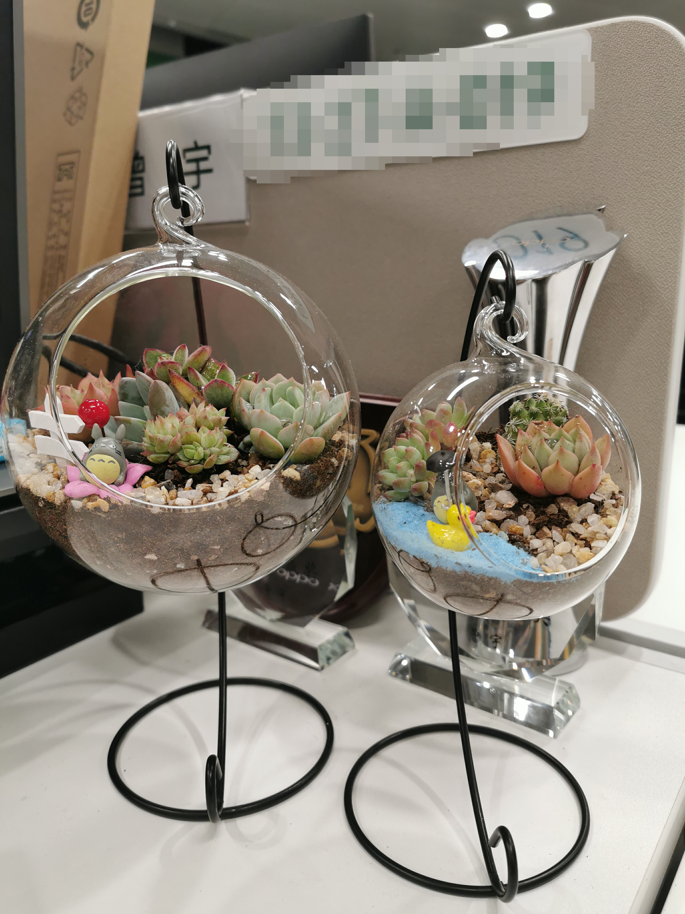

# 2019——充实的一年

## 一、 前言

回想起一年前的此时，也是坐在电脑前，一边回顾总结，一边感叹时光。物是人非，心态早已是天壤之别。

---
## 二、 一年前

刚经历裁员风波，心有余悸，铁了心跑路，渴望换一份饱和的工作。温水煮青蛙，怕自己闲着闲着，就废掉。

之后顺利拿到了绿厂的offer，一番思考之后，选择了深圳，而不是成都。

他乡容不下灵魂，故乡容不下肉身。我想过的生活，现在还得努力追寻。

还有，是为了某个人。

---
## 三、 年后

也许是出于新鲜感和彼此内心的空虚，便在一起了。

沉迷于对未来的幻想，我非常厌恶和抵制现有的工作节奏，即加班强度，也用行动在反对加班，腾出更多空余的时间，去陪伴正确的人。

然而，美好的时光总是如此短暂，感情的世界没有对与错，只有合适与不合适。不久，又各奔东西，成为熟悉的陌生人。

---
## 四、 一心只想工作

工作的繁忙让我很快走出了不太愉快的阴影，并且意识到，努力工作的重要性。这个年纪的人，感情和事业总得占一样，去追求，去拼搏，命运帮我选择了后者，我也就顺其自然地接受了这个安排。

感叹着自己一事无成，一无所有，为什么不抓住机会，给自己找点事，挖掘自己的潜力，挑战自己的极限呢？

别人能做的事，我也要做到，我不承认比别人笨。别人不愿意做的事，我挤时间去做，我不承认比别人懒。别人做不到的事，我争取去做，我不承认比别人差。

曾经我渴望有一番作为，但是平台限制了能力的发挥，如今有这样的平台，我抓住一切机会去施展，看看自己到底能做到什么样。

于是乎，我揽了超出自身能力的活，搞得每天非常繁忙，以至于每时每刻都神经紧张，惦记着一大堆事情没有做完。

9点，10点，11点，到最后日常12点，下班时间越来越晚，加班越来越猛，有时尽管手里已经没有紧急问题，仍然想留在公司，做点事情。回到空洞的家，会感觉很麻木很空虚，但是在公司，不会有那样的氛围。也不知这样是好是坏，总之，我变成了曾经最讨厌的样子，做着曾经反感的事，还乐此不疲，并欺骗自己，这样过得很充实。

原本就有焦虑症，如此一来，逐渐加重。重度焦虑，轻度抑郁。

早已忘记生活是什么样子，日复一日机械式地活着。偶尔会问自己，这是想要的结果？答案似有非有，充满矛盾。失去了对一切事物的新鲜感和热爱，几乎丢掉了一切兴趣爱好，一旦停下来，便感觉非常空虚，于是又赶紧回到工作中，假装那能够让内心充实一点。

人生的意义何在？

我在焦虑什么？谁给我的压力？答案毋庸置疑。同事对我说：“你才23岁啊，你焦虑啥？我23岁才刚毕业呢，你还年轻着。”是啊，我还年轻，可是这一年来，仿佛老了十岁。不只是外表上，更多的是心态。

17年，厦门，18年，珠海，19年，深圳，23岁，已经工作了近三年。一直在漂泊，为的是最终有一个可以让我永远停留下来的地方，和一个属于自己的家庭。为此我不得不拼，我一无所有，便无所顾虑。

居安思危，也许去年的经历确实给我带来太大阴影，职场不存在安全感。

---
## 五、 未来的打算

突然意识到自己这样下去，真的就废了。读到过同行的一句话“工作能力很强的人，最终会毁在工作上。”细想一下，身边一味地追求工作的人，如今过得什么样？过得满意吗？努力工作的目的不就是为了有更好的生活质量，如今放弃生活去追求工作，舍本逐末对吗？确实引人深思。

回想起前年、去年，对自己定下的目标，倍感忏愧。繁忙的工作并不能让内心充实，但会失去初心。适当放慢节奏，去感受生活的乐趣，才能寻找到每天的意义。

买了一些看起来更年轻的衣服，换掉显得过分成熟的衬衣。控制自己的情绪，变得更加有亲和力。保持一颗敬畏之心，低调做人，高调做事。平衡工作与健康，加强锻炼。尝试养一些植物，磨练心境，不再那么浮躁。

2020年会怎样，谁也说不清，也许升职加薪一帆风顺，也许被优化再次漂泊，也许加班到深夜突然就告别这个世界。

不确定的事情，没必要担心，活在当下，及时行乐，用心去感受生活，才不会被生活所抛弃，说不定爱情事业双丰收呢。

